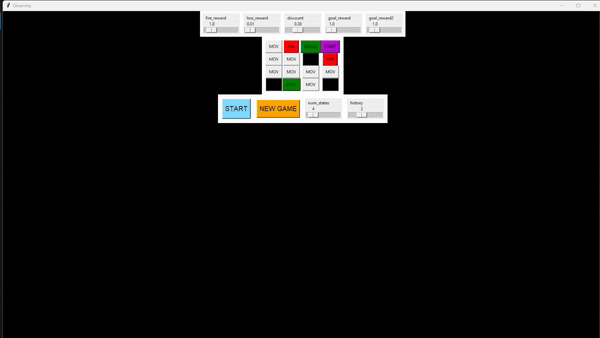

# MazeRL: A Reinforcement Learning Maze Solver


## Overview

MazeRL is a Python application that demonstrates the implementation of reinforcement learning using a graphical interface built with Tkinter. The project features an agent navigating through a maze to reach one of the two goals while avoiding obstacles and walls. The agent learns to find the shortest path to the goals, each of which has adjustable rewards. The application also allows for customization of various parameters to explore different scenarios and complexities.

## Features

- **Agent Navigation:** The agent (indicated by a purple "Start" button) must find the shortest path to either of the two goals (green buttons).
- **Goals:** There are two goals, each with adjustable rewards via sliders.
- **Obstacles:** Red "Fire" buttons act as obstacles, which incur a loss in reward if passed through.
- **Walls:** Black buttons that the agent cannot pass.
- **Customizable Parameters:** 
  - **Goal Rewards:** Adjustable via sliders.
  - **Loss Reward:** Adjustable via slider.
  - **Fire Reward:** Adjustable via slider.
  - **Discount Factor:** Adjustable via slider.
  - **Number of States:** Increase the complexity of the maze.
  - **History:** Adjust the length of the agent's learning history.

## Installation

To run MazeRL, you need to have the following Python libraries installed:

- `tkinter`
- `numpy`
- `pandas`
- `matplotlib`

You can install these dependencies using pip:

```bash
pip install numpy pandas matplotlib
```

## Running the Application

To start the application, run the following command:

```bash
python Reinforcement_learning_board.py
```

## Reinforcement Learning Algorithms

The main reinforcement learning logic is implemented in `Reinforcement_learning.py`. Additionally, you can explore variations of the algorithm in the following files:

- `Qlearning_v1.py` - Implementation of Q-learning technique.
- `ValueLearning.py` - Implementation of Value Learning technique.

## Demonstration

Check out the GIF demonstration of the application below:



## License

This project is licensed under the MIT License.

---

